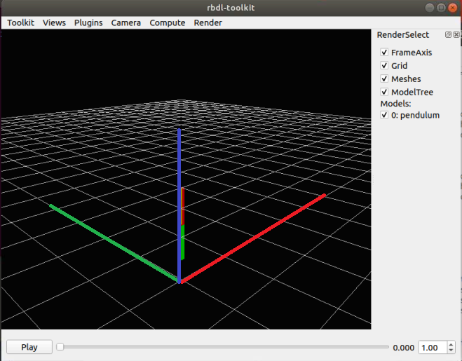

Creating Models
=================

In this wiki I will describe how to create Lua and URDF models. 

## Background

RBDL is capable of working with the following model files: 
- Lua: Lua models are a data structure created in the Lua language. As such, Lua models are simply Lua commands that is evaluated by the Lua compiler and offers strong flexibility. 
- Unified Robot Description Format (URDF): URDF models are XML-based layout commonly used in the Robot Operating System (ROS).  

## Useful functions

The `F5` command in Toolkit reloads all the models, so you can make modifications and quickly see the results instead of needing to reopen the software. 

## Pendulum, kinematics

The first set of example can be found in `./example/pendulum_kinematic`. See below for a breakdown of file. 

### Lua Model, `pendulum.lua`

```
rod_length = 1
```

Since Lua is a programming language, simple assignment operations can be used to set up variables for use for the rest of the document, allowing for rapid modifications. 

```
meshes = {
  rod1 = {
	color = { 1, 0, 0 },
	mesh_center = {0, 0, -rod_length/2},
	dimensions = { 0.1, 0.1, rod_length},
	src = "unit_cube.obj"
  },
  
  rod2 = {
	color = { 0, 1, 0 },
	mesh_center = {0, 0, -rod_length/2},
	dimensions = { 0.1, 0.1, rod_length},
	src = "unit_cube.obj"
  }
}
```

The meshes object denotes how to visualize the model. Regardless of mesh definition, a basic wire-frame will be inserted to denote the mesh. The below code block describes two mesh objects that will later be used in the model itself. 
- `color` denotes the colour of the object in red, green, blue (RGB) order
- `mesh_center` denotes the rotation center of this mesh. If it is set to `{0, 0, 0}`, it will rotate around its centre. 

|  | 
|:--:| 
| Default model from the examples |


|  | 
|:--:| 
| Mesh center set to `{0, 0, 0}`. |

- `dimensions` sets the size of the mesh itself. If it is set to `{0.1, 0.1, 0.1}`, then it will be a 0.1 m cube. 

|  | 
|:--:| 
| Mesh center set to `{ rod_length, 0.1, rod_length}`. |

- `src` denotes the source image file of the mesh. A set of default meshes can be found in `meshes\`

```
model = {
  gravity = { 0, -9.81, 0 },

  configuration = {
	axis_right = { 1, 0, 0 },
	axis_front = { 0, 1, 0 },
	axis_up =    { 0, 0, 1 },
  },

  frames = {
	{
	  name = "segment1",
	  parent = "ROOT",
	  visuals = { meshes.rod1 },
	  joint = {{ 0, 1, 0, 0, 0, 0 }},
	  joint_frame = {
		E = {{1, 0, 0}, {0, 1, 0}, {0, 0, 1}}
	  }
	},
	{
	  name = "segment2",
	  parent = "segment1",
	  visuals = { meshes.rod2 },
	  joint = {{ 0, 1, 0, 0, 0, 0 }},
	  joint_frame = {
		r = { 0., 0., -rod_length },
		E = {{1, 0, 0}, {0, 1, 0}, {0, 0, 1}}
	  }
	}
  }
}
```

- `gravity` denotes the direction of gravity with respect to the global frame. This is an important factor when you are using RBDL to calculate joint torque, but not important in this particular instance because the dynamic parameters are not incorporated yet. 
- `configuration` denotes how the global frame is being visualized. In the default camera view (`Toolkit > Settings > CameraOptions`, position at `<6,3,6>` and view_center at `-4.34917, -1.85781, -4.63835`), then the axis directions are denoted as below:

|  | 
|:--:| 
| `axis_front`, `axis_right`, and `axis_up` denoted as RGB. In the example, this is set to be XYZ. |

- `frames` denote the individual frames that make up the model tree. Each frame require the following elements:
  - `name`, an unique name is required. 

```
return model
```

The model object denotes parameters of the model itself. 


As such, we are denoting The components of each limb are denoted as follows, along with an example code for a right arm model. 

- configuration
- frames
  - body - note that this does not affect the visualization and is only used to calculate joint torque
    - com - centre of mass
    - inertia - inertia matrix 
    - length
    - mass
    - name - *why does the body not have the same name as the frame?*
  - joint - joint directions *needs explaining*
  - joint frame - *needs explaining - is this the offset from the parent frame? *
  - markers - used for inverse kinematics using motion capture markers. denote expected marker position with respect to *where*?
  - name
  - parent - parent frame name
  - points - is this contact modelling? 
  - visuals - these parameters denote the parameters of the mesh overlay for visualization
    - color
    - dimensions - *does this rescale the size of the mesh*
    - mesh_center - 
    - name - *why does the body not have the same name as the frame?*
    - src - source image
- points

```
return {
  configuration = {
    axis_front = { 1, 0, 0,},
    axis_right = { 0, -1, 0,},
    axis_up = { 0, 0, 1,},
  },
  frames = {
    {
      body = {
        com = { 0, 0, -0.17118562968,},
        inertia = {
          { 0.014443744679321, 0, 0,},
          { 0, 0.012867513804128, 0,},
          { 0, 0, 0.0044391953484094,},
        },
        length = 0.2965794,
        mass = 2.23,
        name = "upper_arm",
      },
      joint = {
        { 0, 1, 0, 0, 0, 0,},
      },
      joint_frame = {
        r = { 0, -0.23000000417233, 0.15000000596046,},
      },
      markers = {
        RELB = { -0.0090776672586799, -0.1529101729393, -0.27620485424995,},
        RELBmed = { 0.018008844926953, -0.081582583487034, -0.30799376964569,},
        RSHO = { -0.049410872161388, -0.011108964681625, -0.043191753327847,},
        RUpperArm = { -0.017750661820173, -0.083288162946701, -0.1524580270052,},
      },
      name = "upper_arm_r",
      parent = "ROOT",
      visuals = {
        {
          color = { 0., 0.5, 0.,},
          dimensions = { 0.10998000204563, 0.10998000204563, 0.30660000443459,},
          mesh_center = { 0, 0, -0.15330000221729,},
          name = "upper_arm",
          src = "knubbi_upperarm.obj",
        },
      },
    },
    {
      body = {
        com = { 0, 0, -0.12945115248,},
        inertia = {
          { 0.0073738029548874, 0, 0,},
          { 0, 0.0067977487989258, 0,},
          { 0, 0, 0.0014172422949815,},
        },
        length = 0.2830152,
        mass = 1.20852,
        name = "lower_arm",
      },
      joint = {
        { 0, 1, 0, 0, 0, 0,},
      },
      joint_frame = {
        r = { 0, 0, -0.30660000443459,},
      },
      markers = {
        RELB = { 0.028167443349957, -0.1529101729393, 0.014589850790799,},
        RELBmed = { 0.0019910987466574, -0.081582583487034, -0.017952620983124,},
        RFRA = { 0.0093879494816065, -0.24247792363167, -0.097083911299706,},
        RWRA = { 0.024769067764282, -0.26295864582062, -0.24547196924686,},
        RWRB = { -0.038167472928762, -0.29841965436935, -0.21265962719917,},
      },
      name = "lower_arm_r",
      parent = "upper_arm_r",
      visuals = {
        {
          color = { 0., 0.5, 0.,},
          dimensions = { 0.091650001704693, 0.091650001704693, 0.26499998569489,},
          mesh_center = { 0, 0, -0.13249999284744,},
          name = "lower_arm",
          src = "knubbi_lowerarm.obj",
        },
      },
    },
    {
      body = {
        com = { 0, 0, -0.071679465,},
        inertia = {
          { 0.00147748567122, 0, 0,},
          { 0, 0.00098591328910225, 0,},
          { 0, 0, 0.00060241078090858,},
        },
        length = 0.0907335,
        mass = 0.5,
        name = "hand",
      },
      joint = {},
      joint_frame = {
        r = { 0, 0, -0.26499998569489,},
      },
      markers = {
        RFIN = { -0.057363390922546, -0.32888424396515, -0.03624014928937,},
        RWRA = { 0.024769067764282, -0.26295864582062, 0.019528018310666,},
        RWRB = { -0.038167472928762, -0.29841965436935, 0.052340358495712,},
      },
      name = "hand_r",
      parent = "lower_arm_r",
      points = {
        halx_l = {
          color = { 0., 0.5, 0.,},
          coordinates = { 0.1503, 0, -0.03382,},
        },
      },
      visuals = {
        {
          color = { 0., 0.5, 0.,},
          dimensions = { 0.09179999679327, 0.09179999679327, 0.092000000178814,},
          mesh_center = { 0, 0, -0.04536675,},
          name = "hand",
          src = "knubbi_lowertrunk.obj",
        },
      },
    },
  },
  gravity = { 0, 0, -9.81,},
  points = {
    {
      body = "hand",
      name = "hand_r",
      point = { 0.1503, 0, -0.03382,},
    },
  },
}
```

## URDF

### Loading URDF from Gazebo generated models

Models generated from Gazebo would need access to the meshes that Gazebo utilizes to visualize. The pathing may need to be updated to be absolute path to work. 
